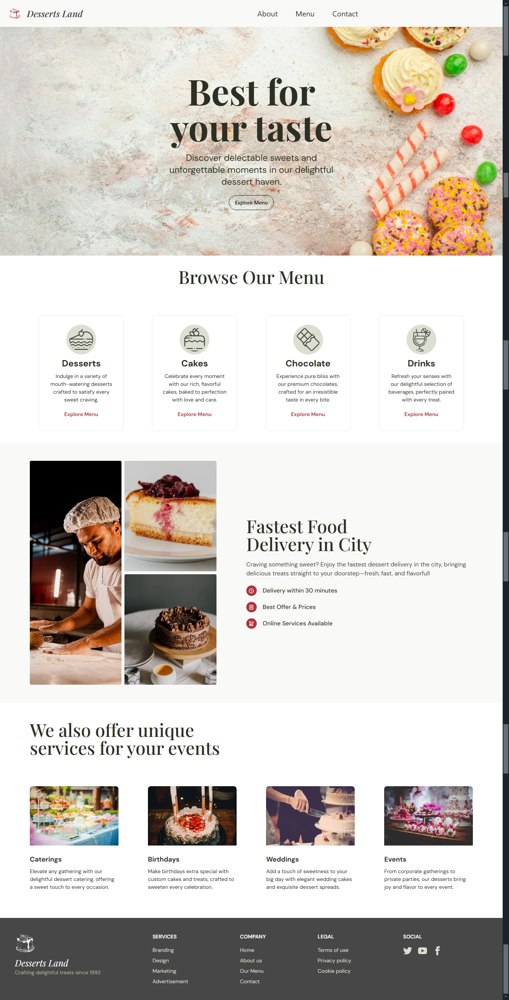

# 🍰 Desserts Land

Desserts Land is a fully functional and visually appealing **e-commerce website** built with modern web technologies. This project leverages **HTML**, **Tailwind CSS**, **DaisyUI**, and **Native JavaScript** to provide a **seamless, interactive, and responsive** user experience. Designed with a **mobile-first approach**, the website ensures smooth performance across all devices.

## 📸 Screenshots

### Desktop View



## 🚀 Live Preview

Experience the live version here: [Desser Land Live](https://dessert-land-7a7a.vercel.app/)

## 🗺️ Website Navigation & Page Purposes

Navigating through **Desser Land** is simple and intuitive:

- 🏠 **Home** – The main landing page where users get an overview of the website and featured desserts. Clicking the website logo redirects users back to this page.
- ℹ️ **About** – Provides insights into the brand, its history, mission, and values.
- 🍽️ **Menu** – Displays the full dessert selection with product filtering and an option to add items to the cart.
- 📞 **Contact** – A contact form where users can send inquiries, provide feedback, or get in touch with customer service.

## 📌 Features

- ✅ **Fully Responsive** – Optimized for all screen sizes
- 🎨 **Modern UI** – Enhanced with **DaisyUI** components
- ⚡ **Interactive User Experience** – Powered by **Native JavaScript**
- 🛍️ **E-commerce Functionality**:
  - 🏷️ **Product Filtering** for refined searches
  - 🛒 **Add to Cart** feature with dynamic updates
- 🚀 **Fast and Lightweight** – Optimized assets and minimal load time

## 🛠️ Technologies Used

- 🏗️ **HTML5** – Semantic structure for better accessibility and SEO
- 🎨 **Tailwind CSS** – Utility-first styling for rapid development
- 🖌️ **DaisyUI** – Pre-styled UI components for a polished look
- ⚙️ **Native JavaScript** – Handles dynamic interactions efficiently

## 🏆 Badges


## 📂 Folder Structure

```
desserts-land/
├── assets/
│   ├── img/
│   │   └── products
│   ├── css/
│   │   ├── input.css
│   │   └── output.css
│   ├── js/
│   │   └── main.js
│   └── products.json
├── index.html
├── about.html
├── menu.html
├── contact.html
├── .gitignore
├── tailwind.config.js
├── README.md
└── package.json
```

## 🛠️ Installation & Usage

Follow these steps to install dependencies and run the project locally:

1. Clone the repository:

   ```sh
   git clone https://github.com/mohamedhesham221/Dessert-Land
   ```

2. Navigate to the project directory:

   ```sh
   cd desserts-land
   ```

3. Install Tailwind CSS and DaisyUI:

   ```sh
   npm install tailwindcss daisyui
   ```

4. Generate the Tailwind CSS file:

   ```sh
   npx tailwindcss -i ./assets/css/input.css -o ./assets/css/output.css --watch
   ```

5. Open `index.html` in your preferred browser to run the project or run a live server.

## 👨‍💻 Author

[](https://www.linkedin.com/in/muhammad-hisham-23544b253/)
[](mailto:muhammedheshamm2@gmail.com)
[](https://muhammadhisham2024.netlify.app/)
